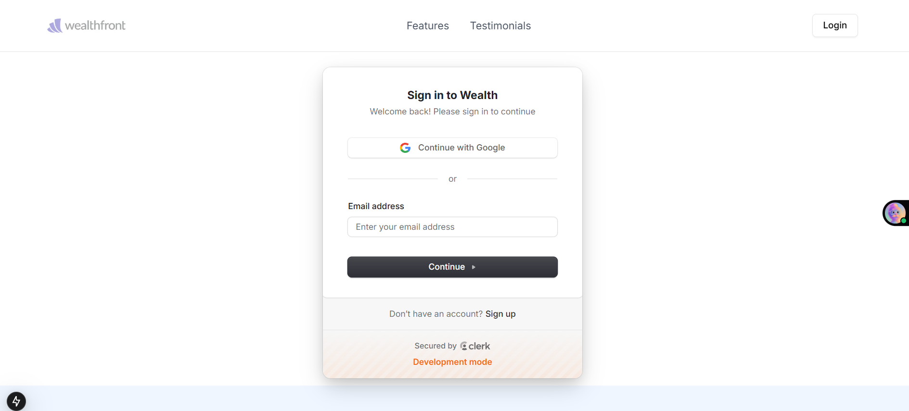
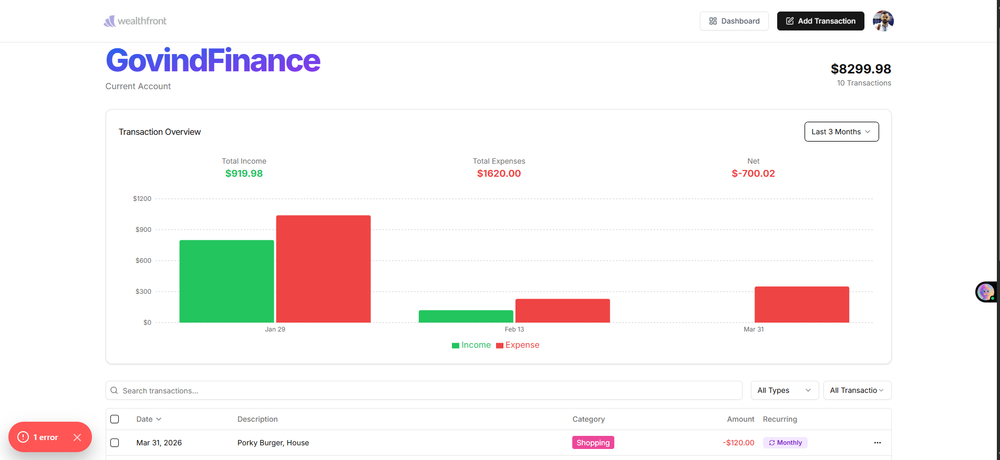
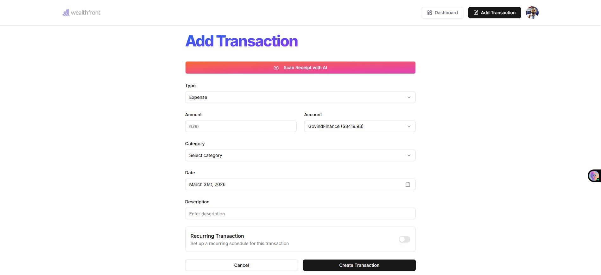

# 💰 Wealth AI — Intelligent Finance Management Platform

Wealth AI is a full-stack finance management platform built with Next.js that enables users to track income and expenses, visualize financial data, and gain AI-driven insights. It integrates secure authentication, real-time analytics, and intelligent features like receipt scanning to simplify personal finance management.

---

## 🚀 Live Demo

👉 Coming Soon (Deployment in progress)

---

## 📸 Project Screenshots

### 🏠 Landing Page


### 🔐 Authentication (Clerk)



### 📊 Dashboard



### ➕ Add Transaction



---

## ✨ Features

* 🔐 Authentication using Clerk (Google + Email)
* 📊 Real-time dashboard (income, expenses, balance)
* 🤖 AI-powered financial insights using Google Generative AI
* 📸 AI-based receipt scanning
* 📈 Data visualization with charts (Recharts)
* 🔁 Recurring transactions
* 📅 Date-based filtering
* 📂 Category-wise expense tracking
* 📧 Email integration using Resend
* ⚡ High performance using Next.js 15 + Turbopack
* 🎨 Modern UI with Tailwind CSS + Radix UI

---

## 🛠️ Tech Stack

### Frontend

* Next.js 15 (App Router)
* React 19
* Tailwind CSS
* Radix UI

### Backend

* Prisma ORM
* PostgreSQL (Supabase)
* Inngest (background jobs)

### Authentication & Security

* Clerk (Authentication)
* Arcjet (Security & Rate Limiting)

### AI Integration

* Google Generative AI (Gemini API)

### Visualization

* Recharts

### Email System

* Resend
* React Email

---

## 🏗️ Architecture

```txt
User → Next.js Frontend → API Routes → Prisma ORM → PostgreSQL Database
```

* Clerk handles authentication
* Inngest manages background jobs
* Resend handles email delivery
* AI processes receipt scanning & insights

---

## ⚙️ Installation & Setup

```bash
git clone https://github.com/your-username/wealth-ai
cd wealth-ai
npm install
```

---

## 🔐 Environment Variables

Create a `.env` file and add:

```env
NEXT_PUBLIC_CLERK_PUBLISHABLE_KEY=your_key
CLERK_SECRET_KEY=your_secret_key
NEXT_PUBLIC_CLERK_SIGN_IN_URL=/sign-in
NEXT_PUBLIC_CLERK_SIGN_UP_URL=/sign-up

DATABASE_URL=your_database_url
DIRECT_URL=your_direct_db_url

ARCJET_KEY=your_arcjet_key

NEXT_PUBLIC_CLERK_AFTER_SIGN_IN_URL=/onboarding
NEXT_PUBLIC_CLERK_AFTER_SIGN_UP_URL=/onboarding

GEMINI_API_KEY=your_gemini_api_key
RESEND_API_KEY=your_resend_api_key
```

---

## ▶️ Run Locally

```bash
npm run dev
```

---

## 🌐 Deployment

* Frontend: Vercel
* Database: PostgreSQL (Supabase)
* Background Jobs: Inngest

> ⚠️ Ensure all environment variables are configured in Vercel before deployment.

---

## 🧠 Challenges & Learnings

* Integrated AI features using Google Generative AI
* Implemented secure authentication using Clerk
* Managed background jobs using Inngest
* Built real-time dashboards with optimized performance
* Integrated transactional email using Resend

---

## 🚀 Future Improvements

* 📱 Mobile app using React Native
* 🔔 Smart notifications & alerts
* 🤖 Advanced AI-based financial recommendations
* 👥 Multi-user collaboration

---

## 👨‍💻 Author

**Govind Kumar Thakur**
Full Stack Developer
